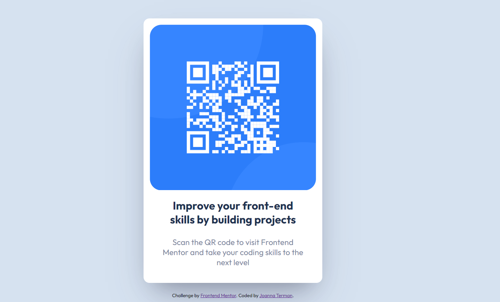

# Frontend Mentor - QR code component solution

## Overview

Built out QR code component as part of a Frontend Mentor practice using HTML and CSS, and following responsive design rules. 

### Screenshot

### Links

https://joanterm.github.io/QR-Code-Component-Challenge/

### Built with

- Semantic HTML5 markup
- CSS
- Flexbox
- Responsive design units
- Desktop-first workflow

